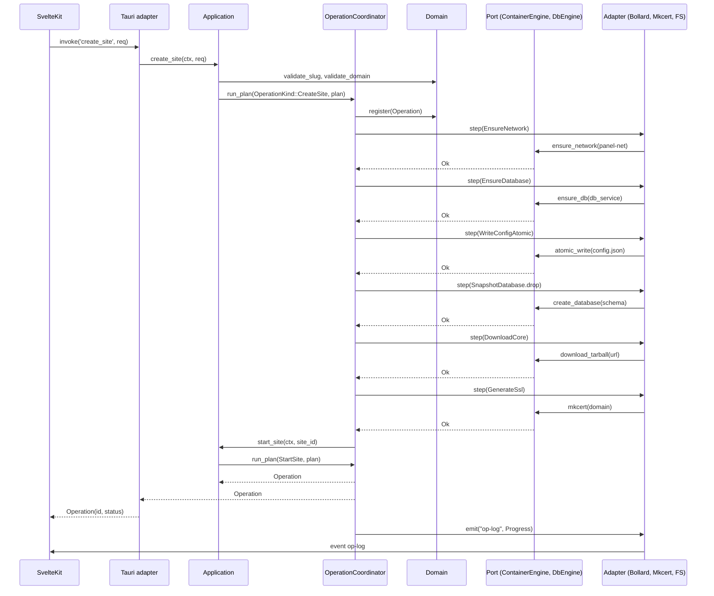

# 02 · Arquitectura objetivo

> Documento 2 de 7 de la serie **Reconstrucción desde cero**.
> Compilador: este capítulo detalla la **forma** de la separación de capas
> `UI → Application → Domain → Ports → Adapters`. Los capítulos 03–07
> desarrollan los contratos, la orquestación, la observabilidad, la calidad
> y el roadmap sobre esta base.

---

## 1. Vista general

```
┌──────────────────────────────────────────────────────────────────┐
│  Ventana Tauri (WebKitGTK)                                       │
│  ┌────────────────────────────────────────────────────────────┐  │
│  │  Frontend SvelteKit (SPA, ssr=false)                       │  │
│  │  routes/+layout.svelte (riel de íconos)                    │  │
│  │  routes/+page.svelte (master-detail proyectos)             │  │
│  │  lib/components/ProjectDetail.svelte, OpConsole, *Modal    │  │
│  │  lib/api.ts (FACHADA IPC TIPADA)                           │  │
│  │  lib/types.ts (zod schemas espejo de serde)                │  │
│  │  lib/contracts/ (tipos generados)                          │  │
│  └───────────────┬────────────────────────────────────────────┘  │
│                  │ Tauri IPC (contrato tipado, scheme validado)  │
│  ┌───────────────▼────────────────────────────────────────────┐  │
│  │  Tauri adapter (src-tauri/src/transport/tauri.rs)          │  │
│  │  - #[tauri::command] one-liners (delegan en use cases)     │  │
│  │  - AppError → { code, message, hint?, cause? }             │  │
│  │  - app.emit("op-log") / "log:{id}" / "sites-changed"       │  │
│  └───────────────┬────────────────────────────────────────────┘  │
│                  │ módulos en Rust puro                          │
│  ┌───────────────▼────────────────────────────────────────────┐  │
│  │  Application API (src-tauri/src/application/)              │  │
│  │  - use cases: start_site, create_site, migrate, snapshot,  │  │
│  │    clone, worktree, create_worktree, repair_*, etc.        │  │
│  │  - OperationCoordinator (plan, journal, cancel, progress)  │  │
│  │  - Policies (reconciler, allowed-slug, allowed-domain)     │  │
│  └───────────────┬────────────────────────────────────────────┘  │
│                  │ puertos (traits)                              │
│  ┌───────────────▼────────────────────────────────────────────┐  │
│  │  Domain (src-tauri/src/domain/)                            │  │
│  │  - entities (Site, Service, Operation, Snapshot, Worktree)  │  │
│  │  - value objects (Endpoint, Slug, DomainName, PortStatus)  │  │
│  │  - lógica pura (idempotencia, compensaciones, journal)     │  │
│  └───────────────┬────────────────────────────────────────────┘  │
│                  │ ports (traits, dyn-safety)                    │
│  ┌───────────────▼────────────────────────────────────────────┐  │
│  │  Ports (src-tauri/src/ports/)                              │  │
│  │  ContainerEngine, ImageBuilder, DbEngine, FileSystem,      │  │
│  │  ProcessRunner, Keyring, Observability, Clock, Shell       │  │
│  └───────────────┬────────────────────────────────────────────┘  │
│                  │ adaptadores                                   │
│  ┌───────────────▼────────────────────────────────────────────┐  │
│  │  Adapters (src-tauri/src/adapters/)                        │  │
│  │  bollard/ (DockerManager) · host/ (mkcert, dnsmasq,        │  │
│  │  NetworkManager, gh, git, fs) · tauri/ (solo registro)    │  │
│  │  dbus/ (zbus) · cli/ (envoltorio wp) · mcp/ (externo)      │  │
│  └────────────────────────────────────────────────────────────┘  │
└──────────────────────────────────────────────────────────────────┘
```

Las tres reglas de CLAUDE.md no cambian. Lo que cambia es la **separación de
responsabilidades** entre:

- **Domain**: reglas de negocio puras (qué es un sitio, qué es una
  operación, qué compensaciones).

- **Application**: orquesta domain + ports, no toca infraestructura.

- **Adapters**: implementan los ports contra el mundo real (bollard, host,
  Tauri, D-Bus, CLI).

- **Tauri adapter**: la única capa que conoce `tauri::command` y
  `app.emit`. `lib.rs` se queda solo en el `setup()` y el `invoke_handler!`.

- **Transports**: además de Tauri, expone D-Bus (DBus Manager) y CLI
  (`wordpress-panel-cli`) que consumen la misma Application API.

- **Reconciliador**: un caso de uso que cruza `desired` (config.json +
  groups.json + panel.json) con `actual` (Docker + `/proc/net/tcp` +
  `/etc/NetworkManager/dnsmasq.d/`) y propone `Drift { kind, target, fix }`.

---

## 2. Límites de módulo

### 2.1 Convenciones estrictas

- **Domain no depende de nada** excepto `serde`, `uuid`, `chrono`, `anyhow`,
  y eventualmente `tracing` para instrumentación. No `tokio`, no `bollard`,
  no `tauri`.
- **Application depende de Domain y de Ports**. Nada de adapters ni de
  crates que abstraigan el mundo real.
- **Ports son traits**. Las implementaciones viven en `adapters/`.
- **Adapters pueden depender de cualquier crate**, pero no se importan
  entre sí salvo a través de `application/` (nunca `bollard` importado
  desde `dbus`).
- **Tauri adapter** solo importa `application/`, no `bollard`, no
  `docker.rs` viejo.
- **CLI / D-Bus / MCP** son adapters de la Application API. No reimplementan
  lógica; consumen los use cases.

### 2.2 Mapa de módulos

```
src-tauri/src/
├── main.rs                          # entry point → lib::run
├── lib.rs                           # setup() + invoke_handler! ≤ 200 líneas
├── application/                     # casos de uso
│   ├── mod.rs                       # AppState, OperationContext
│   ├── lifecycle/                   # start_site, stop_site, stop_all, create_site
│   │   ├── start.rs                 # use case + idempotencia
│   │   ├── stop.rs                  # stop + teardown + export-al-detener
│   │   └── create.rs                # create_site end-to-end
│   ├── import/                      # import_localwp, import_disconnected
│   ├── migrate/                     # migrate_site
│   ├── snapshot/                    # create/list/delete_snapshot, create_clone
│   ├── worktree/                    # create/remove_worktree_site, list_worktrees
│   ├── github/                      # scan, clone, pull, set_deploy, deploy
│   ├── backup/                      # dump_bytes, export_db, rotate_dumps
│   ├── autodump/                    # WatchDatabaseChanges (job background)
│   ├── reconcile/                   # desired vs actual → Drift
│   ├── system/                      # state, first-run, health
│   ├── groups/                      # groups.json CRUD
│   ├── dbus/                        # DBusManager interface
│   └── operation/                   # OperationCoordinator + Plan
├── domain/                          # lógica de negocio pura
│   ├── entity/
│   │   ├── site.rs                  # Site, SiteConfig, SiteState
│   │   ├── service.rs               # Service, Engine, Network
│   │   ├── snapshot.rs              # Snapshot, SnapshotMeta
│   │   ├── worktree.rs              # Worktree, WorktreeInfo
│   │   ├── clone.rs                 # Clone, CloneInfo
│   │   ├── operation.rs             # Operation, OperationId, OpStatus
│   │   └── drift.rs                 # Drift, DriftKind, Fix
│   ├── value/
│   │   ├── slug.rs                  # Slug, slugify, validate
│   │   ├── domain.rs                # DomainName, validate
│   │   ├── endpoint.rs              # Endpoint, Port, LoopbackIp
│   │   ├── paths.rs                 # ProjectsRoot, ConfigDir (SafetyPath)
│   │   └── exclude.rs               # SnapshotExclude, Excludable
│   ├── policy/
│   │   ├── allowed_slug.rs
│   │   ├── allowed_domain.rs
│   │   ├── autoselect_endpoint.rs
│   │   └── teardown.rs              # SharedLifecyclePolicy
│   └── error.rs                     # AppError + AppErrorKind
├── ports/                           # traits (interfaces)
│   ├── container.rs                 # ContainerEngine, ContainerInfo, Exec, Logs
│   ├── image.rs                     # ImageBuilder (panel-php:*)
│   ├── database.rs                  # DbEngine (mysql/mariadb/postgres/sqlite)
│   ├── filesystem.rs                # FileSystem (atomic_write, rename, lock)
│   ├── process.rs                   # ProcessRunner (clocks, std/stdout/err)
│   ├── keyring.rs                   # KeyringAccessor (libsecret)
│   ├── clock.rs                     # Clock (now, sleep)
│   ├── observability.rs             # Tracing, Metrics, Oplog
│   ├── shell.rs                     # Shell (open URL, open path)
│   └── host.rs                      # Host (computer name, user info, paths)
├── adapters/                        # implementaciones
│   ├── bollard/
│   │   ├── container.rs             # impl ContainerEngine
│   │   ├── image.rs                 # impl ImageBuilder
│   │   ├── exec.rs                  # exec_as, exec_capture
│   │   └── mod.rs                   # DockerManager reexport
│   ├── host/
│   │   ├── fs.rs                    # impl FileSystem (atomic_write, lock)
│   │   ├── mkcert.rs                # impl Mkcert
│   │   ├── dnsmasq.rs               # impl DnsmasqConfig
│   │   ├── gh.rs                    # impl GhClient
│   │   ├── process.rs               # impl ProcessRunner (tokio::process)
│   │   ├── shell.rs                 # impl Shell (xdg-open, opener)
│   │   ├── netcheck.rs              # /proc/net/tcp (Linux)
│   │   ├── paths.rs                 # dirs::config_dir
│   │   └── pkexec.rs                # elevación con polkit
│   ├── dbus/
│   │   ├── server.rs                # impl Manager (zbus interface)
│   │   └── mod.rs
│   ├── cli/
│   │   ├── wp.rs                    # generate wrapper script
│   │   ├── cli.rs                   # wordpress-panel-cli install
│   │   └── mod.rs
│   └── tauri/
│       ├── mod.rs                   # invoke_handler, setup
│       ├── commands.rs              # one-liner por command
│       ├── error.rs                 # AppError → serde_json
│       └── events.rs                # emit name bindings
├── platform/                        # abstracciones de plataforma
│   ├── mod.rs
│   ├── linux.rs                     # impls reales
│   ├── macos.rs                     # stubs documentados
│   └── windows.rs                   # stubs documentados
├── config/
│   ├── mod.rs                       # config_dir, projects_root
│   ├── schema.rs                    # schema_version, migrate_to_current
│   └── persist.rs                   # SiteConfig (versiónada)
├── contracts/                       # IDL JSON de la frontera IPC
│   ├── site.proto.json
│   ├── system.proto.json
│   └── ...
└── bin/
    └── wordpress-panel-cli.rs       # binario CLI (D-Bus u omite)
```

### 2.3 Reglas de cambio

- **`domain/`** no se toca a la ligera. Cada cambio en una entity rompe
  `application/`, `transport/`, y el FRONTEND. Toda modificación va con
  migración de schema y entrada en `docs/CHANGELOG.md`.
- **`application/`** es el grueso del código nuevo. Cada use case es
  componible: `start_site(ctx, site_id) -> Result<()>` se reusa por el
  Tauri adapter, el D-Bus adapter, el CLI, y el reconciliador.
- **`ports/`** se mantiene minimalista. Si un trait empieza a tener
  muchos métodos, se rompe (Interface Segregation).
- **`adapters/`** admiten cambio de implementación (p. ej. cambiar
  bollard por otra API) sin tocar el resto.
- **`tauri/`** nunca crece más allá de comandos one-liner. Si crece, es
  señal de que falta un caso de uso.

---

## 3. Domain

### 3.1 Entidades principales

```rust
// domain/entity/site.rs
pub struct Site {
    pub id: SiteId,
    pub name: SiteName,
    pub slug: Slug,
    pub path: SitePath,
    pub domain: DomainName,
    pub group: Option<GroupName>,
    pub services: ServiceSet,
    pub state: SiteState,
    pub flags: SiteFlags,
    pub derived: DerivedInfo,
    pub created_at: DateTime<Utc>,
    pub last_migrated_at: Option<DateTime<Utc>>,
}

pub struct ServiceSet {
    pub php: PhpService,
    pub db: DbService,
    pub nginx: NginxService,
    pub shared: SharedServices, // minio, mailpit flags
}

pub struct SiteFlags {
    pub one_click_admin: bool,
    pub xdebug_enabled: bool,
    pub headless: bool,
    pub frontend_framework: Option<String>,
    pub migration_pending: bool,
}

pub struct DerivedInfo {
    pub clone_of: Option<CloneInfo>,
    pub worktree_of: Option<WorktreeInfo>,
    pub snapshot_excludes: Vec<SnapshotExclude>,
}
```

Las entidades son **inmutables** por defecto. Las actualizaciones devuelven
una nueva instancia:

```rust
impl Site {
    pub fn with_group(self, group: Option<GroupName>) -> Self { … }
    pub fn with_db(self, db: DbService) -> Self { … }
    pub fn with_state(self, state: SiteState) -> Self { … }
}
```

### 3.2 Value Objects

- **`Slug`**: newtype sobre `String`. Validación: `^[a-z0-9][a-z0-9-]{0,63}$`.
- **`SiteName`**: newtype, trimmed, max 100 chars.
- **`DomainName`**: newtype, formato `*.test` o hostname estándar.
- **`SiteId`**: newtype sobre `Uuid`.
- **`Endpoint`**: mantiene `loopback_ip: Ipv4Addr`, `http_port: u16`,
  `https_port: u16`. Validación: ambos en `[1..65535]`, IP en loopback.
- **`SitePath`**: newtype sobre `PathBuf`. Validación: vive bajo
  `ProjectsRoot`, no es symlink peligroso, no solapa con `config_dir`.
- **`ProjectsRoot` / `ConfigDir`**: newtypes que solo se construyen
  desde `config::paths::discover()` (caché + expose).
- **`SnapshotExclude`**: ruta relativa a `public_dir`, normalizada.
- **`PortStatus`**: mantiene la distinción `Free/Wildcard/Specific(Ips)`.

### 3.3 Operaciones y coordinación

```rust
// domain/entity/operation.rs
pub struct OperationId(pub Uuid);

pub struct Operation {
    pub id: OperationId,
    pub kind: OperationKind,    // CreateSite | Migrate | Snapshot | Clone | Worktree | ...
    pub site_id: SiteId,
    pub plan: Plan,
    pub status: OpStatus,
    pub started_at: DateTime<Utc>,
    pub finished_at: Option<DateTime<Utc>>,
    pub journal: Journal,
    pub cancellation: CancellationToken,
}

pub struct Plan {
    pub steps: Vec<Step>,
}

pub enum Step {
    EnsureNetwork,
    EnsureDatabase { db: DbService },
    SnapshotDatabase { dest: PathBuf },
    TarCode { dest: PathBuf, excludes: Vec<SnapshotExclude> },
    WriteVhost,
    ReloadNginx,
    GenerateSsl { domain: DomainName },
    StartContainer { name: ContainerName, image: String },
    RecreateContainer { name: ContainerName, image: String },
    StopContainer { name: ContainerName, timeout: Duration },
    RemoveContainer { name: ContainerName, force: bool },
    RemoveVhost { site: SiteId },
    RemoveSchema { db: DbService, schema: String },
    WriteFileAtomic { path: PathBuf, bytes: Vec<u8> },
    RunHook { command: String, args: Vec<String> },
    Emit { event: EventName, payload: Value },
    Custom { label: String, action: Box<dyn OperationAction + Send + Sync> },
}

pub enum OpStatus {
    Pending,
    Running,
    Succeeded,
    Failed { error: AppError, compensation: Vec<Step> },
    Cancelled,
}

pub struct Journal {
    pub entries: Vec<JournalEntry>, // append-only
}

pub enum JournalEntry {
    StepStarted { step: StepIndex, label: String },
    StepFinished { step: StepIndex, ok: bool },
    Compensated { step: StepIndex, action: Step },
    Log { level: LogLevel, text: String },
}
```

### 3.4 Drift (reconciliación)

```rust
// domain/entity/drift.rs
pub enum DriftKind {
    OrphanContainer { cname: ContainerName, image: String },
    OrphanVhost { path: PathBuf },
    OrphanSchema { container: ContainerName, schema: String },
    SharedRunningButNoActive { container: ContainerName },
    StaleDumpLog,
    SchemaVersionMismatch { cfg: u32, panel: u32 },
    DisconnectedFolder { folder: PathBuf },
    EndpointConflict { port: u16, holder: Option<String> },
    DnsNotResolving { domain: DomainName },
}

pub struct Drift {
    pub kind: DriftKind,
    pub severity: DriftSeverity,
    pub fix: Fix,
}

pub enum Fix {
    RemoveContainer { name: ContainerName, force: bool },
    RemoveVhost { path: PathBuf },
    DropSchema { container: ContainerName, schema: String },
    StopContainer { name: ContainerName },
    UpgradeConfig { from: u32, to: u32 },
    AdoptDisconnected { folder: PathBuf },
    RerunMigrate { site: SiteId },
    ReconfigureEndpoint,
    ReseedDnsmasq,
    Ignore,
}

pub enum DriftSeverity {
    Info,     // no requiere acción
    Warn,     // recomendable
    Error,    // requiere acción
    Critical, // impide operación
}
```

---

## 4. Ports

### 4.1 Catálogo

```rust
// ports/container.rs
#[async_trait]
pub trait ContainerEngine: Send + Sync {
    async fn ensure_network(&self, name: &str) -> Result<(), AppError>;
    async fn network_exists(&self, name: &str) -> bool;
    async fn is_running(&self, name: &str) -> bool;
    async fn exists(&self, name: &str) -> bool;
    async fn container_image(&self, name: &str) -> Option<String>;
    async fn ensure_image(&self, image: &str) -> Result<(), AppError>;
    async fn start(&self, name: &str) -> Result<(), AppError>;
    async fn stop(&self, name: &str, timeout: Duration) -> Result<(), AppError>;
    async fn create(&self, spec: ContainerSpec) -> Result<ContainerId, AppError>;
    async fn remove(&self, name: &str, force: bool) -> Result<(), AppError>;
    async fn recreate(&self, name: &str, image: &str) -> Result<(), AppError>;
    async fn exec(&self, name: &str, cmd: ExecSpec) -> Result<ExecOutput, AppError>;
    async fn exec_as(&self, name: &str, user: UnixUser, cmd: ExecSpec) -> Result<ExecOutput, AppError>;
    async fn exec_capture(&self, name: &str, cmd: ExecSpec) -> Result<Vec<u8>, AppError>;
    async fn logs(&self, name: &str, opts: LogsQuery) -> Result<LogsStream, AppError>;
    async fn stats(&self, name: &str) -> Result<Stats, AppError>;
    async fn list_running(&self) -> Result<Vec<ContainerSummary>, AppError>;
    async fn list_all(&self) -> Result<Vec<ContainerSummary>, AppError>;
}

// ports/database.rs
pub trait DbEngine: Send + Sync {
    fn kind(&self) -> DbType;
    fn image(&self, version: &str) -> String;
    fn datadir(&self) -> &str;
    async fn ensure_db(&self, db: &DbService) -> Result<ContainerName, AppError>;
    async fn wait_ready(&self, container: &ContainerName) -> Result<(), AppError>;
    async fn create_database(&self, container: &ContainerName, schema: &str) -> Result<(), AppError>;
    async fn drop_database(&self, container: &ContainerName, schema: &str) -> Result<(), AppError>;
    async fn dump(&self, container: &ContainerName, schema: &str, opts: DumpOpts) -> Result<DumpHandle, AppError>;
    async fn import(&self, container: &ContainerName, schema: &str, dump: &DumpHandle, opts: ImportOpts) -> Result<ImportReport, AppError>;
    async fn info_schema_size(&self, container: &ContainerName, schema: &str) -> Result<u64, AppError>;
}

// ports/image.rs
pub trait ImageBuilder: Send + Sync {
    async fn ensure_php_image(&self, version: &str) -> Result<ImageTag, AppError>;
}

// ports/filesystem.rs
pub trait FileSystem: Send + Sync {
    fn atomic_write(&self, path: &Path, bytes: &[u8]) -> Result<(), AppError>;
    fn try_lock(&self, path: &Path, timeout: Duration) -> Result<FileLock, AppError>;
    fn read_dir(&self, path: &Path) -> Result<Vec<DirEntry>, AppError>;
    fn remove_all(&self, path: &Path) -> Result<(), AppError>;
    fn copy(&self, src: &Path, dst: &Path) -> Result<(), AppError>;
    fn rename(&self, src: &Path, dst: &Path) -> Result<(), AppError>;
    fn metadata(&self, path: &Path) -> Result<Metadata, AppError>;
    fn exists(&self, path: &Path) -> bool;
}

// ports/process.rs
pub trait ProcessRunner: Send + Sync {
    async fn run(&self, c: &ProcessCommand) -> Result<ProcessOutput, AppError>;
    async fn run_with_stdin(&self, c: &ProcessCommand, stdin: impl AsyncRead + Send + Unpin) -> Result<ProcessOutput, AppError>;
    async fn run_background(&self, c: &ProcessCommand) -> Result<ProcessHandle, AppError>;
}

// ports/keyring.rs
pub trait KeyringAccessor: Send + Sync {
    fn set(&self, account: &str, secret: &str) -> Result<(), AppError>;
    fn get(&self, account: &str) -> Result<Option<String>, AppError>;
    fn delete(&self, account: &str) -> Result<(), AppError>;
}

// ports/clock.rs
pub trait Clock: Send + Sync {
    fn now(&self) -> DateTime<Utc>;
    fn sleep(&self, d: Duration) -> Pin<Box<dyn Future<Output = ()> + Send>>;
}

// ports/observability.rs
pub trait Observability: Send + Sync {
    fn info(&self, target: &str, msg: &str);
    fn warn(&self, target: &str, msg: &str);
    fn error(&self, target: &str, msg: &str);
    fn metric(&self, name: &str, value: MetricValue);
    fn oplog(&self, op: OperationId, evt: OpEvent) -> Result<(), AppError>;
}

// ports/shell.rs
pub trait Shell: Send + Sync {
    async fn open_url(&self, url: &str) -> Result<(), AppError>;
    async fn open_path(&self, path: &Path) -> Result<(), AppError>;
    async fn open_terminal(&self, cwd: &Path, shell_cmd: Option<&str>) -> Result<(), AppError>;
}

// ports/host.rs
pub trait Host: Send + Sync {
    fn hostname(&self) -> String;
    fn user_id(&self) -> u32;
    fn group_id(&self) -> u32;
    fn home_dir(&self) -> &Path;
    fn config_dir(&self) -> &Path;
    fn bin_dir(&self) -> &Path;
    fn available_port(&self, base: u16) -> Option<u16>;
    fn port_holder(&self, port: u16) -> Option<String>;
}
```

### 4.2 Reglas de puertos

- **Un port = un trait**. Métodos pequeños, semánticamente cohesivos.
- **`dyn`-safety**: cada trait es `Send + Sync` y todos los métodos
  devuelven `Self` o tipos no genéricos para permitir `dyn ContainerEngine`.
- **`AppError` siempre**: no se propaga `anyhow` por la frontera de port.
- **Mocks**: cada port tiene un `MockX` en `ports/mocks/` para tests
  unitarios sin Docker.

### 4.3 Inyección de dependencias

`AppState` lleva un `dyn` por port. La construcción vive en
`bin/wordpress-panel.rs::build_context()`:

```rust
pub struct AppContext {
    pub docker: Arc<dyn ContainerEngine>,
    pub mysql: Arc<dyn DbEngine>,
    pub mariadb: Arc<dyn DbEngine>,
    pub postgres: Arc<dyn DbEngine>,
    pub sqlite: Arc<dyn DbEngine>,
    pub images: Arc<dyn ImageBuilder>,
    pub fs: Arc<dyn FileSystem>,
    pub proc: Arc<dyn ProcessRunner>,
    pub keyring: Arc<dyn KeyringAccessor>,
    pub clock: Arc<dyn Clock>,
    pub obs: Arc<dyn Observability>,
    pub shell: Arc<dyn Shell>,
    pub host: Arc<dyn Host>,
    pub cfg: Arc<Config>,
    pub ops: Arc<OperationCoordinator>,
}
```

En producción, los `Arc` apuntan a las implementaciones reales
(`BollardContainer`, `RealFileSystem`, etc.). En tests, a mocks.

---

## 5. Application Layer

### 5.1 OperationCoordinator

Es el **corazón nuevo del rebuild**. Hoje tiene la lógica esparcida en
`worktree.rs::run_create`, `clone.rs::run`, `migrate.rs::run_migration`,
`snapshot.rs::run`, `wordpress.rs::create_site`. El coordinator unifica

estos patrones.

```rust
// application/operation/mod.rs
pub struct OperationCoordinator {
    pub clock: Arc<dyn Clock>,
    pub obs: Arc<dyn Observability>,
    pub journal_dir: PathBuf, // ~/.config/wordpress-panel/operations/
    pub active: Mutex<HashMap<OperationId, OperationHandle>>,
}

pub struct OperationHandle {
    pub op: Operation,
    pub cancel: CancellationToken,
}

pub struct CancellationToken(Arc<AtomicBool>);

impl CancellationToken {
    pub fn cancel(&self) { self.0.store(true, SeqCst); }
    pub fn is_cancelled(&self) -> bool { self.0.load(SeqCst) }
}

#[async_trait]
pub trait OperationAction: Send + Sync {
    fn label(&self) -> &'static str;
    async fn execute(&self, ctx: &OpContext) -> Result<(), AppError>;
    async fn compensate(&self, ctx: &OpContext) -> Result<(), AppError>;
}

pub struct OpContext<'a> {
    pub ctx: &'a AppContext,
    pub op: &'a Operation,
    pub storage: &'a mut OperationStorage,
    pub cancel: CancellationToken,
    pub progress: ProgressSink,
}

pub struct ProgressSink {
    pub sink: Arc<dyn Observability>,
    pub op: OperationId,
}

impl ProgressSink {
    pub fn line(&self, text: impl AsRef<str>) {
        self.sink.oplog(self.op, OpEvent::Line { text: text.as_ref().into() });
    }
    pub fn progress(&self, ratio: f32, units: Option<&str>) {
        self.sink.oplog(self.op, OpEvent::Progress { ratio, units: units.map(str::to_string) });
    }
    pub fn step(&self, idx: usize, total: usize, label: &str) {
        self.sink.oplog(self.op, OpEvent::Step { idx, total, label: label.to_string() });
    }
}
```

#### 5.1.1 API pública

```rust
impl OperationCoordinator {
    pub async fn run_plan(
        &self,
        ctx: Arc<AppContext>,
        kind: OperationKind,
        plan: Plan,
    ) -> Result<Operation, AppError>;

    pub fn cancel(&self, id: OperationId) -> Result<(), AppError>;

    pub fn status(&self, id: OperationId) -> Result<Operation, AppError>;

    pub fn list_active(&self) -> Vec<OperationId>;
}
```

#### 5.1.2 Compensación

Si un step falla, el coordinator ejecuta en reversa **todos** los steps
que ya se completaron, llamando `compensate()`. El journal graba cada
acción de compensación. Si la compensación falla, el journal lo marca
como «pendiente limpieza manual» y la UI lo muestra en rojo.

#### 5.1.3 Cancelación

`cancel(id)` setea el `CancellationToken`. Cada `OperationAction` lo
chequea en puntos seguros (entre steps, dentro de loops que tengan
sentido). La propagación se hace por `&CancellationToken` en el
`OpContext`.

#### 5.1.4 Persistencia del journal

El journal se persiste en `~/.config/wordpress-panel/operations/{id}.jsonl`
(append-only). Permite consultar el estado de operaciones pasadas
(`list_past()`), reanudar dentro de límites (p. ej. retry de un import),
y depurar incidentes.

### 5.2 Casos de uso

#### 5.2.1 `lifecycle::start`

```rust
pub struct StartSiteInput {
    pub site_id: SiteId,
}

pub async fn start_site(ctx: Arc<AppContext>, input: StartSiteInput) -> Result<Operation, AppError> {
    let site = ctx.cfg.find_site(&input.site_id).await?
        .ok_or(AppError::NotFound { what: "site", id: input.site_id.to_string() })?;

    let plan = Plan {
        steps: vec![
            Step::EnsureNetwork,
            Step::EnsureDatabase { db: site.services.db.clone() },
            Step::EnsureImage { image: format!("panel-php:{ver}", ver = site.services.php.version) },
            Step::RecreateContainerIfImageMismatch {
                name: site.container_name(),
                image: format!("panel-php:{ver}", ver = site.services.php.version),
            },
            Step::StartContainer { name: site.container_name() },
            Step::WriteVhost { site_id: site.id },
            Step::EnsureNginx,
            Step::ReloadNginx,
            Step::EnsureDnsmasqWildcard,
            Step::Emit { event: "sites-changed".into(), payload: json!({}) },
        ],
    };

    ctx.ops.run_plan(ctx, OperationKind::StartSite { site_id: site.id }, plan).await
}
```

Los steps son pequeños y componibles. Cada step tiene su `compensate()`
correspondiente (p. ej. `WriteVhost` se compensa con `RemoveVhost`).

#### 5.2.2 `lifecycle::stop`

```rust
pub struct StopSiteInput {
    pub site_id: SiteId,
}

pub async fn stop_site(ctx: Arc<AppContext>, input: StopSiteInput) -> Result<Operation, AppError> {
    // 1. Apagar el watcher de autodump.
    // 2. Dump fresco (export-al-detener).
    // 3. Stop container.
    // 4. Remove vhost.
    // 5. Reload nginx.
    // 6. Teardown_unused_shared.
    // 7. Emit sites-changed.
}
```

#### 5.2.3 `lifecycle::create`

```rust
pub struct CreateSiteInput {
    pub request: NewSiteRequest,
}

pub async fn create_site(ctx: Arc<AppContext>, input: CreateSiteInput) -> Result<Operation, AppError> {
    // Plan: 1. validate slug/domain, 2. write config.json, 3. ensure_db,
    // 4. create_database, 5. download_core, 6. write_php_ini, 7. sync_mu_plugins,
    // 8. ssl generate (if enabled), 9. start_site plan, 10. wp_config_create,
    // 11. wp_core_install.
}
```

#### 5.2.4 `migrate::run`

```rust
pub struct MigrateSiteInput {
    pub site_id: SiteId,
}

pub async fn migrate(ctx: Arc<AppContext>, input: MigrateSiteInput) -> Result<Operation, AppError> {
    // Plan: 1. sync_mu_plugins, 2. ensure_db, 3. create_database,
    // 4. ssl generate (if enabled), 5. start_site plan, 6. wp_config_create,
    // 7. latest_dump, 8. import_dump (with progress), 9. fix_site_url,
    // 10. mark migration_pending=false, 11. emit sites-changed.
}
```

#### 5.2.5 `snapshot::create`, `clone::create`, `worktree::create`

Todos usan el mismo patrón. La diferencia es el `plan` (los steps) y los
valores que pasan. La **infraestructura común** (journal, progreso,
cancel, compensación) no se duplica.

#### 5.2.6 `reconcile::run`

```rust
pub struct ReconcileInput {
    pub autofix: bool,
}

pub struct ReconcileReport {
    pub drifts: Vec<Drift>,
    pub fixed: Vec<Drift>,
    pub refused: Vec<Drift>,
}

pub async fn reconcile(ctx: Arc<AppContext>, input: ReconcileInput) -> Result<ReconcileReport, AppError> {
    // 1. load desired state (config.json, groups.json, panel.json).
    // 2. introspect actual state (docker list, /proc/net/tcp, /etc, filesystem).
    // 3. diff and emit Drift records.
    // 4. Si autofix=true, ejecutar Fix::execute (best-effort).
}
```

### 5.3 Policies

Las **políticas** viven en `domain/policy/` y son funciones puras:

```rust
// domain/policy/teardown.rs
pub fn should_teardown_shared(
    stopped: &Site,
    active: &[Site],
    shared: &SharedService,
) -> bool {
    // Lógica pura sin I/O. Ver `docker.rs::teardown_unused_shared`.
}

// domain/policy/autoselect_endpoint.rs
pub fn autoselect_endpoint(
    used_ports: &[u16],
    local_ips_free_in: &[Ipv4Addr],
) -> Endpoint;

// domain/policy/allowed_slug.rs
pub fn validate_slug(s: &str) -> Result<Slug, AppError>;
```

Reubicar la lógica de `teardown_unused_shared` a una policy pura la
hace **testeable** sin Docker.

---

## 6. Adapters

### 6.1 `bollard/`

Implementa `ContainerEngine` y `DbEngine*` con el cliente `bollard`. El
**único** módulo que importa `bollard`. Las excepciones a bollard
documentadas en `CLAUDE.md` (`docker build`, `docker exec -i`, `docker cp`)
se mantienen como `ProcessRunner::run()` con `Command::new("docker")` en
el adapter `host::docker_cli`.

```rust
// adapters/bollard/container.rs
pub struct BollardContainer {
    pub client: bollard::Docker,
    pub obs: Arc<dyn Observability>,
}

#[async_trait]
impl ContainerEngine for BollardContainer {
    async fn is_running(&self, name: &str) -> bool { … }
    // etc.
}
```

### 6.2 `host/`

- `fs.rs`: `atomic_write` (write a `.tmp` + `rename` atómico), `try_lock`
  (`fs2::FileExt::lock_exclusive` con timeout).
- `mkcert.rs`: `MkcertBinary::generate(domain, dest)`.
- `dnsmasq.rs`: `real_install(ip)` vía `pkexec`.
- `gh.rs`: `gh` / `git` en el host.
- `process.rs`: `tokio::process::Command` envuelto.
- `shell.rs`: `xdg-open`/`opener` para abrir URLs y paths.
- `netcheck.rs`: lee `/proc/net/tcp{,6}` (Linux); en macOS/Windows: stub
  documentado.
- `paths.rs`: `dirs::config_dir()`, `dirs::home_dir()` y nuevas
  constantes (`projects_root`, `config_dir`).
- `pkexec.rs`: `pkexec -- <cmd>` con timeout.

### 6.3 `dbus/`

Implementa `Manager` (zbus) delegando en `application::dbus::*`. Los
métodos D-Bus siguen devolviendo JSON (compatibilidad con `gdbus` y
`qdbus6`), pero el envelope se unifica en `application::dbus::JsonCommand`.

### 6.4 `cli/`

- `wp.rs`: genera `wp` script en `~/.local/bin/wp` (idempotente).
- `cli.rs`: genera `wordpress-panel-cli` (idempotente).
- `mod.rs`: install wrappers en `setup()`.

### 6.5 `tauri/`

`adapters/tauri/mod.rs` contiene solo:

```rust
pub fn invoke_handler() -> Box<dyn Fn(&str) -> bool> {
    Box::new(|name| matches!(name,
        "start_site" | "stop_site" | "stop_all_sites" | "create_site" | ...
    ))
}

pub fn setup(app: &mut App) -> Result<(), Box<dyn Error>> {
    // 1. install_cli_wrapper
    // 2. autodump start for active
    // 3. dbus::serve
    // 4. schedule startup_recovery
    Ok(())
}
```

Cada comando es un `#[tauri::command]` one-liner: validar args → llamar
`application::use_case()` → mapear `AppError` → emitir el evento si
procede → devolver el resultado.

```rust
#[tauri::command]
pub async fn start_site(
    ctx: State<'_, AppContext>,
    id: String,
) -> Result<Operation, AppError> {
    let input = StartSiteInput { site_id: SiteId::parse(&id)? };
    application::lifecycle::start::start_site(ctx.inner().clone(), input).await
}
```

### 6.6 `mcp/` (existente, sin cambios)

El servidor MCP (`mcp/server.mjs`) es **externo** al binario. Sigue
envolviendo `wordpress-panel-cli`. Solo cambia el wrapper para que el
CLI se conecte por D-Bus (igual que hoy) y, si D-Bus no está, falle
con un mensaje claro.

---

## 7. Platform ports

### 7.1 `platform/`

```rust
// platform/mod.rs
pub trait Platform: Send + Sync {
    fn filesystem(&self) -> &dyn FileSystem;
    fn process_runner(&self) -> &dyn ProcessRunner;
    fn shell(&self) -> &dyn Shell;
    fn host(&self) -> &dyn Host;
    fn port_checker(&self) -> &dyn PortChecker;
    fn dns_resolver(&self) -> &dyn DnsResolver;
    fn cert_authority(&self) -> &dyn CertAuthority;
    fn can_install_system_service(&self) -> bool;
}

pub fn current_platform() -> Box<dyn Platform> {
    #[cfg(target_os = "linux")]
    return Box::new(linux::LinuxPlatform::new());
    #[cfg(target_os = "macos")]
    return Box::new(macos::MacOsPlatform::new());
    #[cfg(not(any(target_os = "linux", target_os = "macos")))]
    return Box::new(unsupported::UnsupportedPlatform::new());
}
```

### 7.2 `linux.rs` (por defecto)

- `filesystem`: `nix` con `O_TMPFILE` + `renameat2(RENAME_NOREPLACE)` cuando
  estén disponibles; fallback a `write tmp + rename`.
- `port_checker`: `/proc/net/tcp{,6}` (migrado de `netcheck.rs`).
- `dns_resolver`: `/etc/resolv.conf` + `getent hosts`.
- `cert_authority`: mkcert con detección de CAROOT.
- `can_install_system_service`: true si `pkexec` y `systemctl` están.

### 7.3 `macos.rs` (stubs)

- `filesystem`: `realpath` + `rename`.
- `port_checker`: `lsof -i :port -n -P` (best-effort).
- `dns_resolver`: `scutil --dns` + `dscacheutil -q host -a name`.
- `cert_authority`: openssl manual (mkcert no se empaqueta oficialmente).
- `can_install_system_service`: false. Los pasos de `first-run` que
  requieren `sudo` se documentan en README y fallan con un mensaje claro.

### 7.4 `windows.rs` (stubs)

Sin soporte funcional. Cualquier intento devuelve `AppError::Unsupported`.
La UI lo trata con un mensaje «el panel actualmente no soporta Windows».

---

## 8. Configuración y schemas versionados

### 8.1 `config/mod.rs`

```rust
pub struct Config {
    pub projects_root: ProjectsRoot,
    pub config_dir: ConfigDir,
    pub endpoint: ArcSwap<Option<Endpoint>>,
    pub groups: Arc<Mutex<GroupsFile>>,
    pub dump_log: Arc<DumpLog>,
    pub operation_journal: Arc<OperationJournal>,
    pub panel_config: Arc<Mutex<PanelConfig>>,
}

impl Config {
    pub async fn load_or_init(host: &dyn Host) -> Result<Self, AppError>;
    pub async fn find_site(&self, id: &SiteId) -> Result<Option<Site>, AppError>;
    pub async fn list_sites(&self) -> Result<Vec<Site>, AppError>;
    pub async fn write_site(&self, site: &Site) -> Result<(), AppError>;
    pub async fn migrate_disk_to_current(&self) -> Result<MigrationReport, AppError>;
}
```

### 8.2 Schema versioning

```rust
// config/schema.rs
pub const CURRENT_SCHEMA: u32 = 2;

pub fn migrate_to_current(raw: serde_json::Value) -> Result<SiteConfig, AppError> {
    let version = raw.get("schemaVersion").and_then(|v| v.as_u64()).unwrap_or(1) as u32;
    match version {
        1 => migrate_v1_to_v2(raw),
        2 => serde_json::from_value(raw).map_err(AppError::from),
        v if v > CURRENT_SCHEMA => Err(AppError::Validation {
            field: "schemaVersion".into(),
            message: format!("panel no entiende schemaVersion={v}, máximo: {CURRENT_SCHEMA}"),
        }),
        _ => unreachable!(),
    }
}
```

Cada migración:

- Lee el JSON actual.
- Añade o transforma campos.
- Nunca destruye información.
- Marca `last_migrated_at` solo en migraciones semánticas (no de campo).

### 8.3 Atomic write

```rust
// adapters/host/fs.rs
impl FileSystem for RealFileSystem {
    fn atomic_write(&self, path: &Path, bytes: &[u8]) -> Result<(), AppError> {
        let tmp = path.with_extension("tmp");
        std::fs::write(&tmp, bytes)?;
        std::fs::rename(&tmp, path)?;
        Ok(())
    }
}
```

Variante para «lock + write + rename atómico» cuando hay concurrencia
real (varios procesos / D-Bus + Tauri). Se implementa con `fs2::FileExt`:

```rust
fn try_lock(&self, path: &Path, timeout: Duration) -> Result<FileLock, AppError> {
    let lock_path = path.with_extension("lock");
    let f = OpenOptions::new().create(true).write(true).open(&lock_path)?;
    let deadline = Instant::now() + timeout;
    while !f.try_lock_exclusive()? {
        if Instant::now() > deadline {
            return Err(AppError::Busy { resource: path.display().to_string() });
        }
        std::thread::sleep(Duration::from_millis(50));
    }
    Ok(FileLock { _file: f })
}
```

### 8.4 Migración de disco al arranque

Cuando se detecta un `config.json` sin `schemaVersion` (legacy=v1):

1. `migrate_v1_to_v2` lo transforma en memoria.
2. `write_site` lo persiste (atomic).
3. El journal registra `MigratedConfig { from: 1, to: 2 }`.

---

## 9. Reconciliador

### 9.1 Diseño

```rust
// application/reconcile.rs
pub async fn reconcile(
    ctx: Arc<AppContext>,
    cfg: ReconcileConfig,
) -> Result<ReconcileReport, AppError> {
    let desired = load_desired(&ctx).await?;
    let actual = load_actual(&ctx).await?;
    let drifts = detect_drifts(&desired, &actual);

    let mut report = ReconcileReport::default();
    for drift in drifts {
        report.drifts.push(drift.clone());
        if cfg.autofix && drift.severity != DriftSeverity::Critical {
            match apply_fix(&ctx, &drift).await {
                Ok(()) => report.fixed.push(drift),
                Err(_) => report.refused.push(drift),
            }
        }
    }
    Ok(report)
}
```

### 9.2 Casos cubiertos

| Drift | Origen | Severidad | Fix |
|---|---|---|---|
| `OrphanContainer { cname }` | container `wp-{id}` existe pero id no aparece en configs | Warn | Remove (con confirmación si tiene config válida) |
| `OrphanVhost { path }` | vhost sin `config.json` | Warn | Remove (auto) |
| `OrphanSchema { container, schema }` | schema en DB compartida sin sitio | Warn | Drop (con confirmación) |
| `SharedRunningButNoActive { container }` | nginx corriendo, 0 activos | Warn | Stop (auto) |
| `StaleDumpLog` | entries con archivos `.sql` que ya no existen | Info | Prune (auto) |
| `SchemaVersionMismatch { cfg, panel }` | panel >= proyecto | Error | UpgradeConfig (auto) |
| `DisconnectedFolder { folder }` | `config.disconnected.json` o carpeta sospechosa | Info | Adopt (con UI) |
| `EndpointConflict { port, holder }` | endpoint persistido, puerto ocupado | Error | ReconfigureEndpoint (auto) |
| `DnsNotResolving { domain }` | `*.test` no resuelve | Error | ReseedDnsmasq (auto) |

### 9.3 API expuesta

```rust
#[tauri::command]
pub async fn reconcile(ctx: State<'_, AppContext>, autofix: bool) -> Result<ReconcileReport, AppError>;

#[tauri::command]
pub async fn resolve_drift(ctx: State<'_, AppContext>, drift: Drift, action: ResolveAction) -> Result<(), AppError>;
```

`ResolveAction`:
- `ApplyFix` (ejecuta el Fix propuesto).
- `Ignore` (lo persiste en `ignored_drifts.json` para no repetir).
- `IgnoreForSession` (no lo persiste).

### 9.4 Scheduler

El reconciliador corre en dos modos:

- **Manual**: comando `reconcile(autofix=true|false)`.
- **Programado**: cada 5 minutos al inicio **`startup_recovery`** y
  después de cada `stop_*`/`start_*` (para no dejar surfaces sucias).

---

## 10. Diagrama de secuencia: crear + migrar un proyecto



---

## 11. Capas y ratios de líneas

| Carpeta | LOC objetivo | Notas |
|---|---:|---|
| `domain/` | 1500–2500 | lógica pura, densa |
| `application/` | 4000–7000 | use cases + coordinator |
| `ports/` | 500–800 | traits + mocks |
| `adapters/bollard/` | 800–1200 | único que importa bollard |
| `adapters/host/` | 800–1500 | fs, mkcert, dnsmasq, gh, netcheck |
| `adapters/dbus/` | 200–400 | zbus interface |
| `adapters/cli/` | 200–400 | scripts wp + cli |
| `adapters/tauri/` | 200–400 | commands + setup |
| `config/` | 600–1000 | schema + persist + migrations |
| `bin/` | 200–400 | cli binario + tests |
| `lib.rs` | ≤ 200 | setup + invoke_handler |
| **Total Rust** | **9000–14000** | comparable al actual (≈ 14000) |

Cifras indicativas. La prueba real es que la cobertura de `cargo test`
sin Docker alcance > 80 % en `domain/` + `application/` + `ports/`.

---

## 12. Criterios de aceptación del capítulo

- El `lib.rs` reconstruido ocupa ≤ 200 líneas.
- Agregar un motor DB nuevo (`sqlite`) requiere solo:
  - nueva variante en `DbType`,
  - nueva impl `DbEngine` en `adapters/host/sqlite.rs`,
  - nueva rama en `application::lifecycle::create::mysql_dropdown`,
  - nuevo botón en la UI.
  Total: < 200 líneas añadidas, ninguna existente modificada.
- Agregar un step a un plan existente (p. ej. «disable xmlrpc» en
  `start_site`) es un cambio en una línea + un test.
- El reconciliador pasa un test que **inyecta** un container huérfano
  externo y propone `Drift::OrphanContainer` con fix `RemoveContainer`.
- Compilación en limpio: `cargo build --release` en 2 min en hardware
  objetivo.

---

## 13. Próximo paso

El capítulo 03 (Contratos, estado y persistencia) detalla los contratos
IPC (zod + serde), los schemas versionados, los locks, las escrituras
atómicas, las migraciones de disco, el ciclo de vida de los proyectos
en disco, y la trazabilidad de cada cambio.
